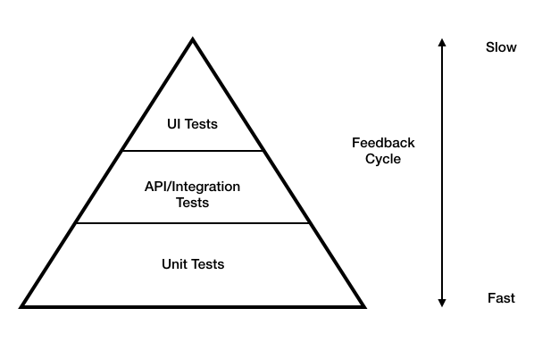

While writing code we often write tests side by side. Ideally tests should cover all the branches of your code and any unwarranted modification should cause a test failure. To ascertain the correctness of our code, we rely on Unit tests and Integration tests.

What is an Integration test?

An integration test tests whether a combined (integrated) set of modules in a codebase work as expected. You can define an integration test for a module (for monoliths) or even for the entire service, if possible (in case of microservices).

## Difference between unit tests and integration tests

Unit test involves testing a "unit" of code for its own behavior isolated from everything else, a unit can be a class or a method, or a module &mdash; the definition is up to you.

Unit tests use mocks, spies and test doubles to a large extent so that only the component under test is the actual piece of live code that is running. While in integration tests, almost all of the service / module code is run.

## What to cover in an integration test?

Your integration tests should cover any externally exposed public interface. This will give you confidence to refactor internal implementation detail at a later point and quickly know if it broke an exposed behaviour.

## How?

There are two schools of thought about integration tests -

1. The "Broad Integration Test" &mdash; Testing your module with live versions of all dependencies.
2. The "Narrow Integration Test" &mdash; Testing your module with a test double of your dependencies.

The one I am writing here is the latter. The former is also commonly called as an end-to-end test.

Integration tests with test doubles is fast and lean enough to be integrated to your build pipeline using the same set of tools and framework you use for writing your unit tests. For example, you can write a integration test for a Java microservice talking to few other REST microservices simply using JUnit and WireMock.

Your integration tests should cover all the expectations from your API like:

1. Request validations
2. Error handling on failure of dependent modules
3. Any locking, concurrency or idempotency guarantees your module provides

Test em' all!

