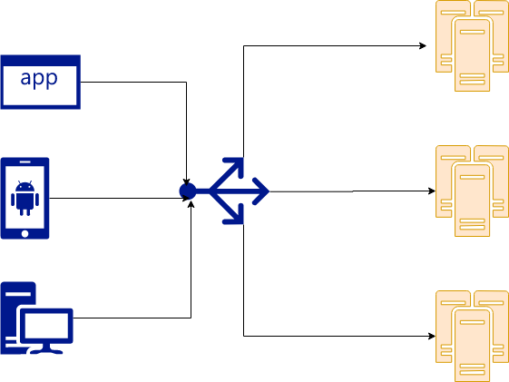

So, if you have been working on web services in this half of the decade, you
must have come across the term "load balancing". So what is load balancing?
Let's find out!

## What is load balancing?

Load balancing, as the name suggests, is distributing work to multiple agents.
In our case, we distribute incoming HTTP requests from browsers, apps or other
servers between a pool of web servers that can serve this request.

## How does load balancing work?

Load balancing works primarily in two ways:

1. Client-side
2. Server-side

### Client-side load balancing

In client-side load balancing, we expect the client to distribute requests to
each of the servers capable of serving the request. We provide the client with
a list of target servers and the client chooses a server by some load balancing
algorithm for each request it makes.

The simplest example is a DNS based load-balancing. Most websites (including
us) use multiple web servers to handle the traffic. Every time you visit a
website, the browser asks the DNS servers to provide a list of IP addresses of
servers hosting the website's content. If the DNS responds with multiple
servers, the browser chooses one and sends the request. For subsequent
requests, the browser would choose another server from the list of servers
returned by the DNS earlier.

Client-side load balancing is also used in microservices utilizing some service
discovery framework like Consul or some service mesh like Istio.

#### Advantages

1. No additional infrastructure required
2. Simple to implement

#### Disadvantages

1. Unreliable, as we do not have control over external clients like browsers

### Server-side load balancing

In server-side load balancing, we run an additional server called a "Load
Balancer", a reverse-proxy that is responsible for distributing requests among
application servers that can handle the request. Application servers register
themselves with the load balancer. Client requests first reach the load
balancer and it routes to one of the registered application servers based on
its configuration.
Server-side load balancing is much more common. We use servers such as NGINX,
Envoy, HA Proxy or services like Amazon ELB, Cloudflare etc for load
balancing.

#### Advantages

1. More control over load balancing

#### Disadvantages

1. Additional infrastructure requires cost and maintenance

## Load balancing algorithms

A load-balancing algorithm determines how requests are distributed among the
origin servers.

### Round-robin

This is the simplest load balancing algorithm. It assigns requests to servers
in a pool one after the other.

### Least Connection

This algorithm assigns requests based on which server has the least amount of
connections (load).

### Weighted

This is a variant of any of the above load balancing algorithms with a slight
modification. Every server known to the load balancer now has a weight
associated with it. This weight can be based on how close or how powerful the
application server is to the load balancer etc. The higher the weight, the
higher number of requests get assigned to the origin server.

### Adaptive

This algorithm adapts its routing based on metrics provided by the application
servers usually involve monitoring response times or some form of telemetry
from the application servers.

### Sticky

Sometimes (esp legacy web-apps) web application maintains some server-side
local state in the form of sessions. This forces you to route the subsequent
requests to the server that handled the first request by the client. Such
routing is called sticky load balancing. Avoid such architecture, it does not
scale well.

This was a small intro about load balancing. The best way to learn is to
spin-up a few servers and experiment. I hope you enjoyed reading this article!
